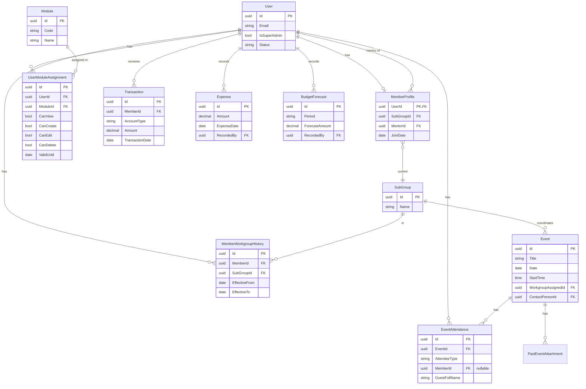

# Catholic Professional (CP) Management System — Design Document

**Version:** 1.0  
**Date:** March 2026  
**Purpose:** Design specification for a cloud-based web portal to manage CP membership, finances, attendance, events, and communication.

---

## 1. Executive Summary

The Catholic Professional group requires a **cloud-based web portal** with **module-based access** (same interface for all logged-in users; admins and default members see different menu items and actions based on their assigned modules and permissions) to:

- **Automate** manual treasurer workflows (payment validation, reporting).
- **Track** meeting/activity attendance (currently missing).
- **Improve transparency** via member dashboards and group-wide analytics.
- **Enforce compliance** through automated reminders and system-driven exit rules (13 months arrears).
- **Preserve knowledge** via an event repository and dynamic calendar.

This document defines the system architecture, data models, user flows, and implementation approach to meet these objectives.

---

## 2. System Overview & Architecture

### 2.1 High-Level Architecture

```
┌─────────────────────────────────────────────────────────────────────────────┐
│                        CP Management System (Cloud)                          │
├─────────────────────────────────────────────────────────────────────────────┤
│  Web Portal (SPA)     │  Backend API        │  Jobs / Workers               │
│  • Public landing page│  • REST/GraphQL     │  • Paybill import parser       │
│  • Single app (all    │  • Auth (JWT/OAuth) │  • Reminder (email/WhatsApp)   │
│    logged-in users)   │  • RBAC             │  • Compliance check (monthly)  │
│  • Permission-driven  │  • File storage     │  • Event reminders             │
│    menu & actions     │                     │                                │
│  • Responsive (PWA)   │                     │                                │
└─────────────────────────────────────────────────────────────────────────────┘
         │                         │                          │
         ▼                         ▼                          ▼
┌─────────────────────────────────────────────────────────────────────────────┐
│  Integrations: Parish Paybill Export │ Email (SMTP/SendGrid) │ WhatsApp API  │
│  Optional: Telegram Bot (group/channel management)                           │
└─────────────────────────────────────────────────────────────────────────────┘
```

### 2.2 Design Principles

- **Single interface for all logged-in users:** Both **admins** (or users with extra modules) and **default members** use the **same application** after login. There is no separate "Admin UI" vs "Member Portal". The only difference is that each user sees **menu items and actions according to their module assignments and permissions**: a user with more modules (e.g. Finance, User Management) sees more items on the menu; a default member sees only the modules they have (e.g. Personal Dashboard, Group Wide Reports, Past Events, Calendar/Upcoming Events). Buttons and routes for modules the user cannot access are hidden or disabled.
- **Cloud-first:** Hosted on a reliable cloud provider for availability and backups. For **free-tier hosting**, see **[HOSTING_AND_STACK.md](HOSTING_AND_STACK.md)** for a recommended architecture and platforms (e.g. Vercel + Supabase + cron-job.org).
- **Module-based access:** Granular permissions (view, edit, create, delete) per module; roles like Treasurer or Moderator are implemented by assigning modules (e.g. Finance full vs read-only) via User Management.
- **Mobile-friendly:** Responsive web app (and optional PWA) for marking attendance and checking balances on phones.
- **Audit trail:** Log sensitive actions (payment imports, member status changes, removals) for transparency.
- **De-personalized enforcement:** Compliance and exit rules are system-driven; messages are standardized templates.

---

## 3. Roles, Modules & Granular Permissions

Access is controlled by **assignable modules** and **granular permissions** (view, edit, create, delete) per module. Who gets which module and permissions is managed in the **User Management** module. **All logged-in users (admins and default members) use the same interface;** the menu and available actions are driven by each user's assigned modules and permissions, so admins simply see more menu items and capabilities.

### 3.1 Granular Permissions

Each module supports one or more of these **permissions**:

| Permission | Meaning |
|------------|--------|
| **View** | Read-only access to the module’s data and screens. |
| **Create** | Can create new records (e.g. new event, new member). |
| **Edit** | Can update existing records. |
| **Delete** | Can delete records (where applicable). |

Permissions are **assigned per user per module**. Not every module exposes every permission (e.g. Personal Dashboard is view-only).

### 3.2 System Modules

The **application structure** (menu and sub-modules) is defined in **§3.7**. The table below maps **assignable modules** to permissions; each can contain sub-modules (e.g. Finance → Expenses, Budget, Payments).

| Module | Typical permissions | Notes |
|--------|---------------------|--------|
| **Personal Dashboard** | View | Mentor (nullable), list of mentees, join date with years in CP, CP kitty compliance, welfare, activity attendance index, CP score. |
| **Group Wide Reports** | View (default), Edit/Create/Delete (if assigned) | Anonymized financial and group analytics; **features expenses records** and **forecasted budget** (budget vs actual, projections). |
| **Past Events** | View | Event repository: reports, budget, lessons learned. |
| **Calendar / Upcoming Events** | View | Calendar and list of upcoming events. |
| **Events** | View, Create, Edit, Delete | Create/edit/delete events; **Create, Edit, Delete can be assigned temporarily** (with expiry date). |
| **Attendance** | View, Create, Edit | Mark or edit attendance for events (add attendee, member/guest). |
| **Finance** | View, Create, Edit, Delete | Paybill import, balances, arrears, reports. Treasurer: full; Moderator: read-only (View only). |
| **User Management** | View, Create, Edit, Delete | Manage users and their **module assignments** (who has which module with which permissions). |
| **Reminders Configuration** | View, Edit | Configure when and how the **monthly member reminder** is sent (date of month, email/WhatsApp); content includes personal arrears, upcoming events, past month events snapshot. |
| **Downloads** | View (default), Create/Edit/Delete (if assigned) | List of documents members can **view or download** (e.g. CP Constitution, Mentorship Guidelines, Web Portal Documentation). Admins can add/update/remove documents. |
| **Inquiries Management** | View, Create, Edit | View and manage **guest inquiries** from the landing page (Join / Send inquiry). List inquiries; add notes; update status (New / Contacted / Converted); convert to member via Add Member. |

Additional modules (e.g. **Membership** for add/edit member, **Compliance**, **Communication**) can be defined similarly; permissions are enforced in API and UI per assignment.

### 3.3 Default Member Access

**By default**, when a member is onboarded, they receive **view-only** access to:

- **Personal Dashboard**
- **Group Wide Reports**
- **Past Events**
- **Calendar / Upcoming Events**
- **Downloads**

No create/edit/delete on Events, and no Finance or Attendance access, unless explicitly assigned via **User Management**.

### 3.4 Assignment Examples

- **Treasurer:** Assign **Finance** module with **View, Create, Edit, Delete** (full rights).
- **Moderator (e.g. oversight):** Assign **Finance** module with **View** only (read-only).
- **Event coordinator (temporary):** Assign **Events** (and optionally **Attendance**) with **Create, Edit, Delete** and set an **expiry date**; after that date the assignment is no longer valid and the member keeps only default view access to calendar/upcoming events.
- **User Management:** Only users with **User Management** (e.g. Create or Edit permission) can assign or revoke modules/permissions for other users. **Super Admin** has all modules and full permissions by default and cannot be restricted.

### 3.5 Temporary Permissions (Events)

For the **Events** module, **Create**, **Edit**, and **Delete** can be assigned **temporarily**:

- When assigning Events (Create/Edit/Delete) to a member, the admin sets an optional **Valid until** date.
- After that date, the assignment is treated as expired; the member retains only View access to calendar/upcoming events (and any other default or non-expired assignments).
- Expired assignments can be renewed by updating **Valid until** in User Management.

### 3.6 Authentication & Mentor

- **Authentication:** Email + password; optional SSO (e.g. Google) later.
- **Authorization:** Every API and UI action checks the user’s **module assignments** and permissions (view/create/edit/delete) for the relevant module.
- **Mentorship:** A member can have **one mentor or zero** (single MentorId, nullable). A member can have **many mentees** (other members whose MentorId points to this member). No separate role; mentor/mentee is stored on the member profile and shown on the Personal Dashboard.

### 3.7 Application Structure (Modules & Sub-modules)

The app is structured into the following **modules** and **sub-modules**. Menu and routes follow this hierarchy; visibility and actions depend on the user's assigned modules and permissions (§3.1–3.4).

| Module | Sub-modules / Screens | Description |
|--------|------------------------|-------------|
| **Personal Dashboard (My Dashboard)** | *(single screen)* | Member's own dashboard: mentor, mentees, join date with years in CP, CP kitty compliance, welfare, activity attendance index, CP score. View only. |
| **Membership** | **Add New Member** | Onboarding: add a new member (name, contact, email, sub-group, mentor); system sends temp password and email. |
| | **View List of All Members** | List of all members with **search**, **filter by parameters** (e.g. workgroup, status), **select a member** → **transfer workgroup** or **assign mentor**. |
| **Finance** | **Expenses** | Record and view expenses (description, amount, date, category); featured in Group Wide Reports. |
| | **Budget** | Budget forecasting (period, line items, forecast amounts); featured in Group Wide Reports. |
| | **Payments** | Paybill import, member transactions, balances, arrears (CP-KITTY, CP-Welfare). |
| **Events** | **Events Summary Page** | Overview of events; **option to add new event**. |
| | **Past Events Listing** | List of past events with **search**, **filter**, **select event** and **amend** (edit/attachments/attendance) based on permissions. |
| | **Upcoming Events** | List/calendar of upcoming events with **option to select and filter**. |
| **Group Wide Reports (View Only)** | **Group dashboard** | High-level group dashboard (anonymized). **Filter and export.** |
| | **Budget report** | Budget vs actual, forecasts. **Filter and export.** |
| | **Payments report** | Payments/contributions summary. **Filter and export.** |
| | **Expenses report** | Expenses summary and listing. **Filter and export.** |
| | **Membership report** | Membership and workgroup stats. **Filter and export.** |
| **Downloads** | **Document list** | List of all documents a member can **view or download** (e.g. CP Constitution, Mentorship Guidelines, Web Portal Documentation). Admins with Create/Edit/Delete can add, update, or remove documents. |
| **Inquiries Management** | **Inquiries list** | List of **guest inquiries** (from landing page: name, contact, email, message). **Search**, **filter** (e.g. by status); **select inquiry** → add **Notes**, update **Status** (New / Contacted / Converted), or **convert to member** via Add Member. |
| **Notifications Settings** | *(single screen)* | Configure monthly reminder: send date (day of month), channels (email/WhatsApp). Content: personal arrears, upcoming events, past month snapshot. |
| **User Management** | *(user list, user detail, module assignments)* | Manage users and their **module/permission assignments** (assign or revoke modules, set View/Create/Edit/Delete, temporary Events permissions). |

- **Default members** see: Personal Dashboard (My Dashboard), Group Wide Reports (View Only) with all report sub-modules, **Downloads** (document list), and (if applicable) read-only or filtered views of Events (e.g. Upcoming Events, Past Events listing). They do not see Membership, Finance, Events (create/edit), **Inquiries Management**, Notifications Settings, or User Management unless assigned.
- **Treasurer / officials** are assigned the relevant modules (e.g. Finance with full permissions, Membership, Events, Notifications Settings, **Inquiries Management**, User Management) and therefore see the corresponding menu items and sub-modules.
- **Filter and export:** Where indicated, reports and listings support **filter** (by date range, workgroup, status, etc.) and **export** (e.g. CSV/Excel) for Group Wide Reports and, where applicable, member/event lists.

**Quick reference — module tree:**

```
Personal Dashboard (My Dashboard)

Membership
├── Add New Member
└── View List of All Members  [search, filter, select member → transfer workgroup | assign mentor]

Finance
├── Expenses
├── Budget
└── Payments

Events
├── Events Summary Page  [+ Add new event]
├── Past Events Listing  [search, filter, select event → amend by permission]
└── Upcoming Events  [select, filter]

Group Wide Reports (View Only)
├── Group dashboard  [filter, export]
├── Budget report  [filter, export]
├── Payments report  [filter, export]
├── Expenses report  [filter, export]
└── Membership report  [filter, export]

Downloads
└── Document list  [view / download — e.g. CP Constitution, Mentorship Guidelines, Web Portal Documentation]

Inquiries Management
└── Inquiries list  [search, filter by status; select → add notes, update status, convert to member]

Notifications Settings

User Management
```

---

## 4. Core Modules

### 4.0 Landing Page (Public)

The portal has a **public landing page** (no login required) that serves as the entry point for the CP community and guests.

- **Welcome message:** A prominent welcome message to Catholic Professionals (CP), e.g. tagline and short intro.
- **Member login:** Clear option for **members to log in** (link/button to the login page).
- **Join / Inquiry (guests):** Guests who would like to join CP can **send an inquiry** via a form with:
  - **Name**
  - **Contact** (phone or preferred contact)
  - **Email**
  - **Message** (any additional message)
  Submissions are stored and can be reviewed by officials (e.g. in an Inquiries or Leads list); optionally, an email notification is sent to a configured address.
- **Information about CP:** A section with **information about CP** — purpose, workgroups (Community Outreach, Team Building, Spiritual Development), how the group operates. Content can be static or admin-editable (e.g. rich text or markdown).
- **Featured past events:** A section showing **featured past events** (e.g. title, date, image banner, short description). Admins can mark selected past events as "featured" for the landing page; only featured past events are shown here.
- **Featured upcoming events:** A section showing **featured upcoming events** (title, date, venue, link to more info or registration if applicable). Admins can mark selected future events as "featured" for the landing page.
- **Contacts:** A **contacts** section with CP contact details (e.g. committee email, parish contact, or general inquiry contact). Can be configurable (e.g. in system config or a simple "Contact" content block).

The landing page is **unauthenticated**; after login, members are taken to the member area (e.g. Personal Dashboard). No sensitive data is shown on the landing page.

### 4.1 Membership & Sub-Groups

- **Sub-groups (workgroups, fixed):** Community Outreach, Team Building, Spiritual Development.
- **Member record:** Name, phone, email, **current** sub-group (workgroup), join date, status (Active / Paused / Exited), **one mentor or none** (MentorId FK to User, nullable), **many mentees** (members who have this user as MentorId).
- **Onboarding (Admin):** “Add Member” form: name, phone, email, sub-group, mentor. On submit:
  - System creates account with **temporary password** (random, secure).
  - Sends **email** with login link and instruction to complete profile and change password.
  - Member appears in member list and in treasurer/attendance views immediately.
  - System records the initial workgroup in the **workgroup history** (audit trail) with EffectiveFrom = join date and EffectiveTo = null (current).
- **Workgroup transfer (membership register):** A member can be **transferred** from one workgroup to another. When an authorised user changes a member's workgroup:
  1. The member's **current** workgroup (MemberProfile.SubGroupId) is updated to the new workgroup.
  2. The system **closes the previous history record** by setting **EffectiveTo** = today (or transfer date) for the row that had EffectiveTo = null for that member.
  3. The system **inserts a new history record** for the new workgroup with **EffectiveFrom** = today (or transfer date) and **EffectiveTo** = null (current).
- **Audit trail:** The system keeps a **workgroup membership history** so that for any member you can see: **from this date to this date, the member was in this workgroup**. This supports reporting, compliance, and historical accuracy. The current workgroup is still on the member profile for quick filtering and display; the history table is the source of truth for "was in X from date A to date B".

### 4.2 Financial Management

- **Fee structure (configurable in system):**
  - **Annual fee:** 1,000 (per membership year).
  - **Monthly CP subscription:** 300.
  - **Monthly welfare:** 300.
- **Payment sources:** Members pay via **church paybill**; they use payment account **CP-KITTY** or **CP-Welfare** (and optionally reference in message).
- **Workflow:**
  1. Parish Secretary provides **monthly paybill export** (CSV/Excel).
  2. Treasurer **uploads** file in Admin → Finance → “Import Paybill”.
  3. System **parses** file (configurable column mapping: phone, amount, date, account/reference).
  4. **Matching:** Match by phone number (and optionally name) to members; allocate to CP-KITTY or CP-Welfare based on account/reference.
  5. **Validation:** Treasurer can review suggested matches (and fix/cancel) before **confirming** import. Balances update only after confirm.
  6. **Audit:** Each import is logged (who, when, file name, row count, applied transactions).

- **Expenses:** The treasurer (or users with Finance Create/Edit permission) can **add expenses** in the Finance module. Each expense record typically includes description, amount, date, and optionally category or account (e.g. CP-KITTY vs Welfare). Expenses are stored for reporting and for comparison with budget/forecast. **Expense records are featured in the Group Wide Reports** (see below).
- **Budget forecasting:** The treasurer can create and maintain **budget forecasts** (e.g. by month or quarter: expected income, planned expenses, or line items). Forecasts support planning and variance analysis. **Forecasted budget is featured in the Group Wide Reports** alongside actuals (contributions, expenses) so the group can see budget vs actual and projections.

- **Personal Dashboard (member view):** The member's dashboard shows:
  - **Mentor:** The member's mentor (name/link), or null if none.
  - **Mentees:** List of mentees (members who have this member as mentor).
  - **Month and year joined CP:** e.g. "March 2024", with **years in CP in brackets** (e.g. "Joined March 2024 (2 years in CP)").
  - **High-level summary:** CP kitty compliance, welfare (compliance), activity attendance index, CP score. These give a quick view of financial and participation standing without full detail (detail can be available via links or separate sections).
- **Group-wide reports (Group Wide Reports module):** High-level, **anonymized** dashboard for the whole group. It **features**:
  - **Expenses records:** Summary and list of expenses (e.g. by period, category), so the group can see how funds are used.
  - **Forecasted budget:** Budget forecasts entered by the treasurer, alongside **budget vs actual** and **projections** (e.g. total kitty/welfare, expected vs actual).
  - Optional: breakdown by sub-group (aggregated, no individual member names in default view). Users with Group Wide Reports (View) can see this; treasurer/officials with Finance can maintain the underlying expenses and forecasts.

### 4.3 Attendance Tracking

- **Managing attendance (per event):** For an event whose **date is current (today) or in the past**, users with Attendance permission can:
  1. **View** the event and see the **attendees list** (names with a clear label per row: **Member** or **Guest**).
  2. **Add an attendee** via an "Add attendee" action:
     - **From members list:** Search and select a member; the attendee is recorded as a **Member**.
     - **As guest:** Admin enters **full name(s)** only; the attendee is recorded as a **Guest**.
- **When add-attendee is available:** The option to **add attendees** to an event is **only shown when the event date is the current date or a past date**. For future-dated events, the event can be viewed (and edited if the user has Events Edit permission) but the "Add attendee" action is not offered until the event date is today or has passed.
- **Attendance list display:** Each row shows the attendee name and, alongside it, whether they are a **Member** or **Guest**. No separate checklist of all members; attendance is built by explicitly adding each attendee (member or guest).
- **Reporting:** Pre-built report: "Members' attendance" (per member: count of events attended vs total in period, **attendance %**). Only member attendances count toward CP Score and member reports; guest attendances are for records only.
- **Member view:** "My attendance %" (e.g. last 12 months or current year) and list of events they attended.

### 4.4 Events & Calendar

- **Event creation (Events module):** When creating an event, the following are captured:
  - **Title** (required)
  - **Theme** (optional)
  - **Description / Agenda** (optional)
  - **Date** (required)
  - **Start Time** (optional)
  - **Image banner** (optional; upload or URL)
  - **Workgroup assigned** (optional; the sub-group coordinating the event, e.g. Community Outreach, Team Building, Spiritual Development)
  - **Contact Person** (optional; selected from the **members list**)
  - Venue, reminder schedule, and other fields may be included as needed (e.g. reminder schedule for notifications).
- **Calendar vs Past Events:** Events are listed in two places based on **event date**:
  - **Calendar:** Events whose **date is ahead of** the current date (future events) are listed under **Calendar** (and in calendar/upcoming-views).
  - **Past Events:** Events whose **date is in the past** are listed under **Past Events** (event repository). The same event moves from Calendar to Past Events when its date passes.
- **Managing attendance:** For a given event, the **option to add attendees** is only available when the event date is **current (today) or past** (see §4.3). Future events are visible and editable but do not show the add-attendee action.
- **Dynamic calendar:** Annual (and monthly) view of future events. Users can open any event to view details; for current/past events, users with Attendance permission can manage attendance (see §4.3).
- **Reminders (optional):** When creating or editing an event, a reminder schedule (e.g. "7 days before", "1 day before") can be set. A background job sends email (and optionally WhatsApp) to members with event details.
- **Event types:** Can be tagged (e.g. "Monthly meeting", "Activity", "Retreat") for filtering and reporting.
- **Feature on landing page:** When creating or editing an event, the admin can set **Featured on landing page** (FeaturedOnLanding). Featured past events appear in the landing page "Featured past events" section; featured upcoming events appear in "Featured upcoming events".

### 4.5 Knowledge Management — Past Events

- **Event repository (“Past Events”):** After an event, the organizing sub-group (or Admin) can attach:
  - **Post-event report** (document/PDF).
  - **Budget** (summary or file).
  - **Attendance list** (export or manual upload for historical events).
  - **Lessons learned** (text or document).
- **Search:** Search by date range, sub-group, event type, or free text (title, lessons learned). Accessible to Admin (and optionally to Members as read-only “archive”).

### 4.6 Reminders Configuration

- **Purpose:** A dedicated module where the admin configures the **monthly reminder** sent to all members. The reminder is sent on a **configurable date of the month** (e.g. 1st, 5th, 10th) to each member's **email** and **WhatsApp** number.
- **Configuration (admin):**
  - **Send date:** Choose which **day of the month** the reminder runs (e.g. 5th of every month).
  - **Channels:** Enable/disable **Email** and **WhatsApp** (e.g. send to both, or email only if WhatsApp is unavailable).
  - Optional: template or intro text for the reminder (e.g. greeting, sign-off). Placeholders can include member name, arrears, events list.
- **Content of the monthly reminder (per member):** Each member receives a **personalized** message containing:
  1. **Member's personal arrears:** A summary of their own arrears (e.g. annual fee, CP kitty, welfare — what is due, what is overdue), so they can clear them via the church paybill.
  2. **Upcoming events that month:** A snapshot of **events scheduled for the current month** (title, date, venue or link), so members can plan to attend.
  3. **Snapshot of events done the past month:** A short list of **events that took place in the previous month** (title, date), with a line **encouraging members to check out the event reports** (e.g. "View reports and lessons learned in Past Events" or a link to the Past Events module).
- **Delivery:** A scheduled job runs on the configured day each month; for each active member it builds the above content and sends via email and/or WhatsApp. Logs are kept (e.g. NotificationLog) for audit.
- **Who can access:** Users with **Reminders Configuration** module and **Edit** permission can change the send date and channels; **View** allows seeing current settings.

### 4.7 Communication & Notifications

- **Channels:** Email (primary), WhatsApp (optional, via WhatsApp Business API).
- **Monthly member reminder:** Configured and sent as in §4.6 (Reminders Configuration); content includes personal arrears, upcoming events that month, and past month events snapshot with encouragement to check reports.
- **Other automated reminders (financial):** Optional additional weekly or monthly arrears-only reminders; the main monthly reminder in §4.6 can serve as the primary touchpoint.
- **Event reminders:** As in §4.4 (e.g. 7 days and 1 day before each event).
- **Templates:** All outgoing messages use **templates** (with placeholders for name, arrears, event title, etc.) so wording is consistent and can be reviewed by committee.

### 4.8 Compliance & De-personalized Exit

- **Rule:** If a member has **13 months of arrears** (or equivalent rule as defined by CP), membership is **paused** and they are removed from the group chat.
- **Process (automated, 1st of each month):**
  1. **Compliance job** runs: For each member, compute months in arrears (based on financial module).
  2. If arrears ≥ 13 months:
     - Set member status to **Paused** (or Exited, per policy).
     - Send **standardized exit message** (e.g. “Dear [Name], your CP membership is currently paused due to inactivity [and arrears]. If you wish to rejoin, please contact [contact].”).
     - **Remove from WhatsApp group** via WhatsApp Business API, **or** if using **Telegram**, remove from group / restrict in channel via bot (Telegram allows robust bot management).
- **Human element removed:** The “blame” is on system rules; officials only configure the threshold (e.g. 13 months) and the message template.
- **Re-join:** Manual process (Admin reactivates member and re-adds to chat after they clear arrears and request re-join).

### 4.9 CP Score & Ranking

- **Formula (configurable weights):**
  - **Meeting/activity attendance:** 50%.
  - **Financial compliance:** 40%.
  - **Mentorship / sub-group participation:** 10%.
- **Implementation:**
  - **Attendance component:** % of events attended in the scoring period (e.g. last 12 months).
  - **Financial component:** % of expected payments made (annual + monthly CP + welfare) in the period.
  - **Mentorship/participation:** Binary or tier (e.g. has mentee(s), participated in organizing an event) — simple rules to be defined by CP.
- **Output:** Per-member **CP Score** (e.g. 0–100). **Top performers** (e.g. top 10 or top 20%) can be **highlighted** on the monthly group-wide dashboard (optional anonymization: “Top contributors this month” with or without names, per CP policy).
- **Refresh:** Score computed periodically (e.g. monthly, after payment import and attendance updates).

### 4.10 User Management

- **Purpose:** Manage **users** (members and officials) and their **module/permission assignments** so that roles like Treasurer or Moderator are reflected by assigned modules (e.g. Finance full vs read-only) rather than a single “admin” role.
- **Who can access:** Users who have **User Management** with at least **View** permission can see the list of users and their assignments; **Edit** (or **Create**) is required to assign or revoke modules/permissions for other users. **Super Admin** has full User Management by default.
- **Capabilities:**
  - **User list:** View all members/users; filter by status, sub-group; search by name/email.
  - **User detail:** View and edit profile (name, phone, email, sub-group, mentor, status); change password or send reset link.
  - **Assign modules & permissions:** For a selected user, assign one or more **modules** with a combination of **View**, **Create**, **Edit**, **Delete**. Optionally set **Valid until** for temporary assignments (e.g. Events Create/Edit/Delete).
  - **Revoke or reduce:** Remove a module assignment or reduce permissions (e.g. from full Finance to Finance view-only).
  - **Audit:** Log who assigned/revoked what and when (for sensitive changes).
- **Default assignments:** When a new member is created (onboarding), the system automatically grants the **default member modules** (Personal Dashboard, Group Wide Reports, Past Events, Calendar/Upcoming Events, **Downloads**) with **View** only. Further assignments (Finance, Events, Attendance, User Management, Reminders Configuration, **Inquiries Management**) are done explicitly via User Management.
- **Temporary Events permissions:** When assigning Events with Create/Edit/Delete, the admin can set **Valid until**; after that date the assignment expires and the member keeps only default view access to calendar/upcoming events until reassigned.

### 4.11 Downloads

- **Purpose:** A **Downloads** module that presents a **list of all documents** a member can **view or download**. Examples include **CP Constitution**, **Mentorship Guidelines**, **Web Portal Documentation**, and any other reference or policy documents the committee makes available.
- **Member view:** Users with **Downloads** (View) see a single screen listing the available documents (title, optional short description). Each document has a **view** and/or **download** action (e.g. open in browser or download file). Documents are stored in the system (e.g. file storage) and linked from the list.
- **Admin management:** Users with **Downloads** (Create/Edit/Delete) can **add** new documents (upload file, set title and optional description/category), **edit** (title, description, replace file), and **remove** documents from the list. Optional: category or sort order for the list.
- **Who can access:** Default members receive **Downloads** with **View** only. Admins can be assigned **Create, Edit, Delete** to manage the document list.
- **Data:** Each document is stored as a record (title, description, file reference/URL, optional category, sort order) so the list can be maintained without code changes.

### 4.12 Inquiries Management

- **Purpose:** Manage **guest inquiries** submitted from the landing page (Join / Send inquiry). Officials can view the list, add notes, update status, and convert an inquiry into a new member.
- **Inquiries list:** Single screen listing all inquiries: **Name**, **Contact**, **Email**, **Message**, **SubmittedAt**, **Status** (e.g. New / Contacted / Converted). **Search** and **filter** (e.g. by status, date range). **Select an inquiry** to view detail, **add Notes** (admin-only text), **update Status**, or **convert to member** (opens Add Member with pre-filled name, contact, email; official completes sub-group, mentor, etc.).
- **Who can access:** Not included in default member access. Users with **Inquiries Management** (View) can see the list; **Edit** (or **Create**) allows adding notes, updating status, and converting to member. Assign to officials who handle join requests (e.g. membership secretary).
- **Data:** Uses existing **MembershipInquiry** entity (§5.1); no new entities required.

---

## 5. Data Models (Conceptual)

### 5.1 Core Entities

- **User**  
  Id, Email, PasswordHash, Name, Phone, IsSuperAdmin (boolean; bypasses module checks), Status (Active/Paused/Exited), CreatedAt, UpdatedAt.

- **MemberProfile** (1:1 User for members)  
  UserId, SubGroupId (current workgroup), JoinDate, MentorId (FK User, nullable; one mentor or none), PreferredName. Mentees are derived: members whose MentorId = this UserId.

- **MemberWorkgroupHistory** (audit trail of workgroup transfers)  
  Id, MemberId (UserId), SubGroupId, EffectiveFrom (date; start of period in this workgroup), EffectiveTo (date; nullable — null means current), RecordedBy (UserId; who performed the transfer or initial assignment), RecordedAt.  
  For each member there is one row with EffectiveTo = null (current workgroup); all previous assignments have EffectiveTo set when the member is transferred. On onboarding, one row is created with EffectiveFrom = JoinDate and EffectiveTo = null.

- **Module** (system-defined list of modules)  
  Id, Code (e.g. PersonalDashboard, GroupWideReports, PastEvents, Calendar, Events, Attendance, Finance, UserManagement, Downloads, RemindersConfiguration, InquiriesManagement), Name, Description, PermissionsAvailable (JSON or flags: which of view/create/edit/delete apply).

- **UserModuleAssignment**  
  Id, UserId, ModuleId, CanView, CanCreate, CanEdit, CanDelete (booleans), ValidFrom (optional), ValidUntil (optional; for temporary assignments), AssignedBy (UserId), AssignedAt.

- **SubGroup**  
  Id, Name (Community Outreach | Team Building | Spiritual Development), Description.

- **FinancialAccount**  
  Id, MemberId, Type (AnnualFee | CPKitty | Welfare), YearOrMonth, AmountExpected, AmountPaid, DueDate, UpdatedAt.

- **Transaction** (from paybill import)  
  Id, MemberId, AccountType (CP-KITTY | CP-Welfare), Amount, TransactionDate, SourceFileId, ImportBatchId, CreatedAt.

- **Expense** (treasurer-recorded expenses)  
  Id, Description, Amount, ExpenseDate, CategoryOrAccount (optional; e.g. CP-KITTY | Welfare | general), RecordedBy (UserId), CreatedAt. Featured in Group Wide Reports.

- **BudgetForecast** (treasurer budget forecasting)  
  Id, Period (e.g. Year, Month or YearMonth), LineItemOrCategory (optional), ForecastAmount, Notes (optional), RecordedBy (UserId), CreatedAt. Featured in Group Wide Reports (budget vs actual, projections).

- **Event**  
  Id, Title, Theme (optional), DescriptionAgenda (optional), Date, StartTime (optional), ImageBannerUrl (optional), Venue (optional), WorkgroupAssignedId (optional; FK SubGroup), ContactPersonId (optional; FK User — selected from members list), ReminderDays (e.g. [7,1]), FeaturedOnLanding (boolean; show in landing-page featured past/upcoming sections), CreatedBy, CreatedAt.

- **MembershipInquiry** (guest inquiries from landing page)  
  Id, Name, Contact (phone or contact string), Email, Message (text), SubmittedAt, Status (e.g. New / Contacted / Converted), Notes (admin), CreatedAt.

- **DownloadableDocument** (Documents in Downloads module)  
  Id, Title, Description (optional), FileStoragePathOrUrl, Category (optional; e.g. Constitution, Guidelines, Documentation), SortOrder (optional), IsActive (boolean), CreatedBy (UserId), CreatedAt, UpdatedAt. Members with Downloads (View) see active documents; admins with Create/Edit/Delete manage the list.

- **EventAttendance**  
  Id, EventId, AttendeeType (Member | Guest), MemberId (nullable; FK User when AttendeeType=Member), GuestFullName (when AttendeeType=Guest), RecordedAt, RecordedBy (Admin UserId).

- **PastEventAttachment**  
  Id, EventId, Type (Report | Budget | AttendanceList | LessonsLearned), FileUrlOrText, UploadedBy, UploadedAt.

- **NotificationLog**  
  Id, MemberId, Channel (Email | WhatsApp), TemplateId, SentAt, Payload (e.g. arrears breakdown).

- **ComplianceRun**  
  Id, RunAt, MembersChecked, MembersPaused, MembersRemovedFromChat, Log (JSON).

### 5.2 Configuration Tables

- **SystemConfig:** Fee amounts, arrears threshold (months), WhatsApp/Telegram toggle; optional keys for **landing page** (welcome message, about CP text, contact details).
- **MonthlyReminderConfig:** SendDayOfMonth (1–28), SendEmail (boolean), SendWhatsApp (boolean), OptionalTemplateId (FK MessageTemplates or null). Used by the Reminders Configuration module (§4.6); the monthly job runs on this day and sends the reminder (personal arrears, upcoming events that month, past month events snapshot + encouragement to check reports) to all members.
- **MessageTemplates:** Name, Channel, Body, Placeholders (e.g. {{MemberName}}, {{ArrearsBreakdown}}, {{UpcomingEvents}}, {{PastMonthEvents}}).
- **PaybillImportMapping:** Column names for phone, amount, date, account/reference for the parish export format.

### 5.3 Entity Relationship (Mermaid)



---

## 6. Integration Points

| Integration | Purpose | Notes |
|-------------|---------|--------|
| **Parish paybill export** | Upload CSV/Excel; parse and match to members | Configurable column mapping; optional validation rules (min amount, date range). |
| **Email (SMTP / SendGrid)** | Onboarding, reminders, event reminders, exit messages | Template-based; track opens/clicks optional. |
| **WhatsApp Business API** | Reminders, exit message; remove from group | Requires Business API approval; consider fallback to “manual removal list” if API limits. |
| **Telegram Bot** | Alternative to WhatsApp for group management | Native bot controls for remove/restrict; group or channel. |

---

## 7. Security & Compliance

- **Data:** Personal data (name, phone, email) stored securely; access only per role. Consider encryption at rest and in transit (HTTPS, encrypted DB).
- **Passwords:** Temporary passwords are one-time; force change on first login. Use strong hashing (e.g. bcrypt/argon2).
- **Audit:** Log payment imports, status changes, removals, and Admin actions for accountability.
- **Privacy:** Group-wide analytics anonymized; CP Score and “top performers” visibility configurable (e.g. names only to Admin, or agreed with members).
- **Backups:** Regular automated backups of database and uploaded files; retention per church policy.

---

## 8. Implementation Roadmap (Phased)

| Phase | Scope | Outcomes |
|-------|--------|----------|
| **1. Foundation** | Auth, RBAC, Member CRUD, Sub-groups, Mentor assignment, Add Member + email temp password | Officials can onboard members; members can log in and see profile. |
| **2. Finance** | Fee config, paybill upload, parsing, matching, approval, balances & arrears; member dashboard (contributions + arrears); treasurer report | Treasurer stops manual tracking; members see their position. |
| **3. Attendance & Events** | Events CRUD, calendar, checklist + optional self-register link; attendance report; event reminders | Attendance tracked and reported; event reminders automated. |
| **4. Knowledge & CP Score** | Past event attachments, search; CP Score algorithm, top performers on dashboard | Knowledge retained; recognition automated. |
| **5. Compliance & Comms** | Arrears reminder job; 13-month rule; exit message; WhatsApp/Telegram removal (or removal list); optional Telegram migration | De-personalized enforcement; reduced friction. |

---

## 9. Success Criteria

- Treasurer can **import paybill** and have member balances/arrears updated with minimal manual work.
- **Attendance** is captured for all relevant meetings/activities and reflected in reports and CP Score.
- **Members** see a single place (Personal Dashboard) for mentor, mentees, join date with years in CP, and high-level summary (CP kitty compliance, welfare, attendance index, CP score).
- **Reminders** and **exit process** run on schedule without officials having to send or remove people manually.
- **Past events** are searchable; **calendar** and **reminders** support planning and follow-up.
- **CP Score** and **top performers** are visible per agreed policy, supporting recognition and culture.

---

## 10. Appendix

### A. Glossary

- **CP-KITTY:** Paybill account for CP subscription (and optionally annual fee).
- **CP-Welfare:** Paybill account for welfare contributions.
- **Arrears:** Amount or months of unpaid expected fees/subscriptions/welfare.
- **Paused:** Member status when removed due to arrears; can be reactivated after clearing arrears.

### B. Open Decisions

- Naming of “Paused” vs “Exited” and re-join process.
- Whether to show member names on group-wide “top performers” or keep anonymized.
- WhatsApp vs Telegram for group and removal (cost, approval, and church preference).
- Exact paybill export format(s) from Parish Secretary (to define default column mapping).

### C. Document History

| Version | Date | Author | Changes |
|---------|------|--------|---------|
| 1.0 | Mar 2026 | Design | Initial design covering all CP Digitization Committee requirements. |

---

*This design is intended to be implemented as a cloud-based web application with a responsive frontend and a secure backend API, plus scheduled jobs for reminders and compliance. Adjustments to fees, thresholds, and messaging are expected to be configurable by Admins where possible.*
